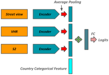
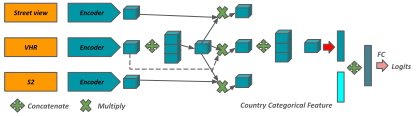
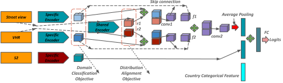

# 📝 [AI4EO Map Your City Challenge 2024](https://platform.ai4eo.eu/map-your-city/data)

---

## Challenge Summary

Participants of this challenge are asked to develop a multi-modal model to estimate the construction year of any given building from 3 modality inputs: street-view imagery, VHR resolution top-view imagery, Medium Resolution S2 imagery. For half of the test set, street-view imagery will be missing, so the developed solution should address the issue of missing modality.

My solution includes modeling two classification models: type I where training and inference are conducted on all modalities, type II where training is done on all modalities, but inference is conducted only on top-view imageries. The second model is inspired by the Shared-Specific Feature Modelling approach in [3](https://openaccess.thecvf.com/content/CVPR2023/papers/Wang_Multi-Modal_Learning_With_Missing_Modality_via_Shared-Specific_Feature_Modelling_CVPR_2023_paper.pdf).

- Type I:
  * [Feature Concatenation](https://github.com/xmba15/ai4eo_map_your_city/blob/master/src/models/model.py#L255)

    

  * [Geometric Fusion](https://github.com/xmba15/ai4eo_map_your_city/blob/master/src/models/model.py#L319)

    

- [Type II](https://github.com/xmba15/ai4eo_map_your_city/blob/master/src/models/model.py#L150):

    

## 🎛 Development environment

---

```bash
mamba env create --file environment.yml
mamba activate ai4eo
```

## :gem: References

---

1. [Model Fusion for Building Type Classification from Aerial and Street View Images](https://www.mdpi.com/2072-4292/11/11/1259#)
2. [Multi-modal fusion of satellite and street-view images for urban village classification based on a dual-branch deep neural network](https://www.sciencedirect.com/science/article/pii/S0303243422001209)
3. [Multi-Modal Learning With Missing Modality via Shared-Specific Feature Modelling](https://openaccess.thecvf.com/content/CVPR2023/papers/Wang_Multi-Modal_Learning_With_Missing_Modality_via_Shared-Specific_Feature_Modelling_CVPR_2023_paper.pdf)
